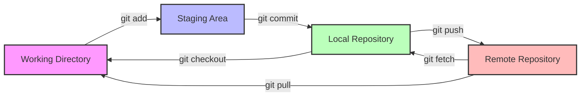
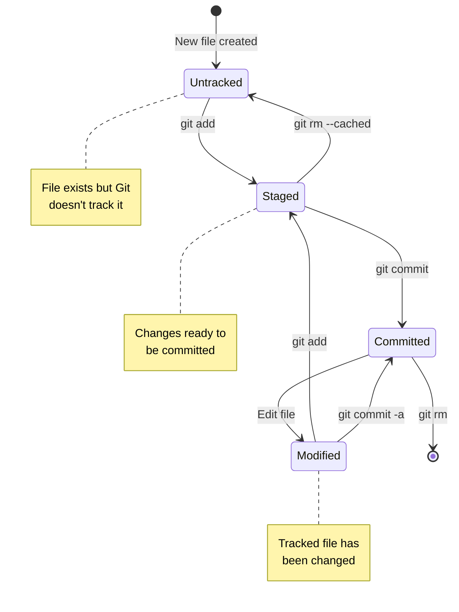
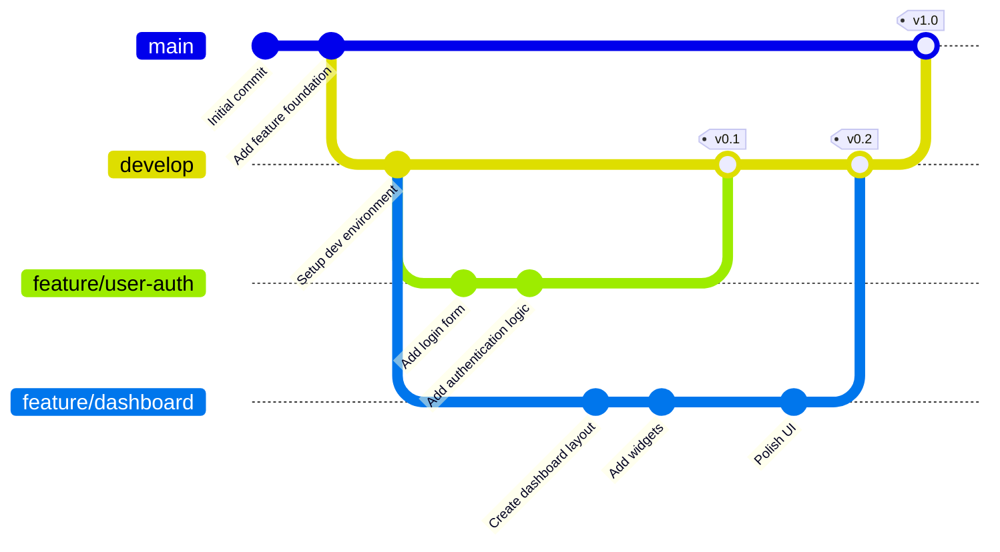
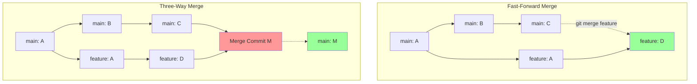
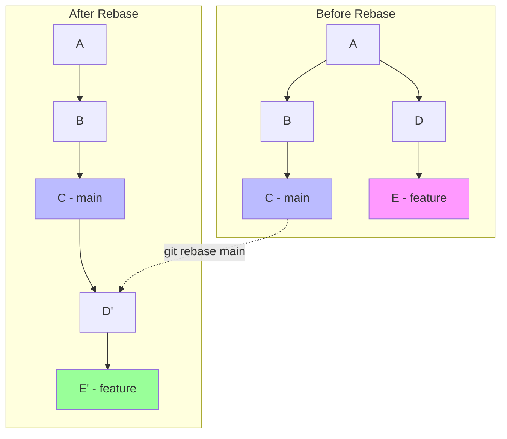
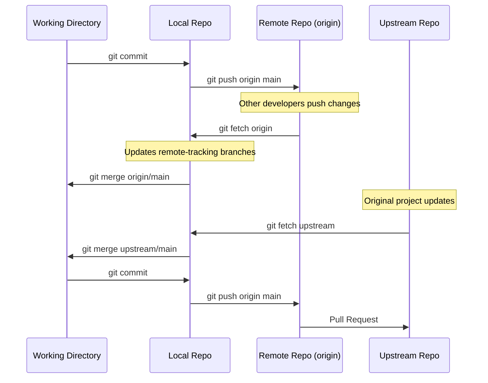
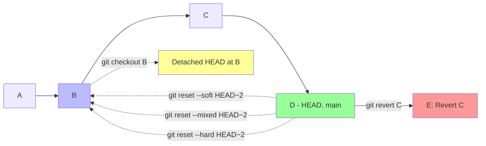
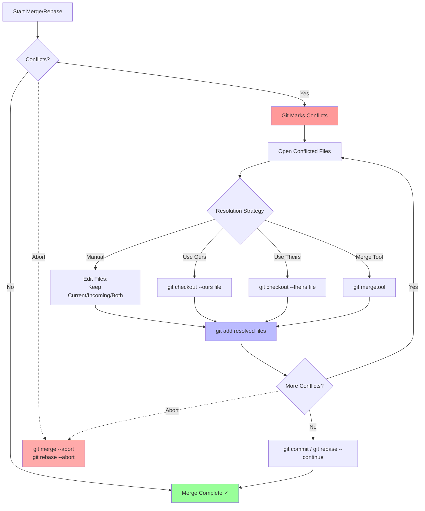

# Git Tutorial with Visual Diagrams

This comprehensive guide explains Git concepts using Mermaid diagrams for clear visualization.

## Table of Contents

1. [Git Workflow Basics](#git-workflow-basics)
2. [Git File States](#git-file-states)
3. [Branching Strategy](#branching-strategy)
4. [Merging Concepts](#merging-concepts)
5. [Rebasing Workflow](#rebasing-workflow)
6. [Remote Operations](#remote-operations)
7. [Git History and Time Travel](#git-history-and-time-travel)
8. [Conflict Resolution](#conflict-resolution)

---

## Git Workflow Basics

The fundamental Git workflow involves three main areas: Working Directory, Staging Area (Index), and Repository.



### Key Commands:
- `git add <file>` - Stage changes
- `git commit -m "message"` - Commit staged changes
- `git push` - Push commits to remote
- `git pull` - Fetch and merge remote changes
- `git checkout <file>` - Discard working directory changes

---

## Git File States

Files in Git can exist in different states throughout their lifecycle.



---

## Branching Strategy

Branching allows parallel development and is essential for collaborative work.



### Common Branch Types:
- **main/master** - Production-ready code
- **develop** - Integration branch for features
- **feature/** - New features or enhancements
- **hotfix/** - Urgent production fixes
- **release/** - Release preparation

---

## Merging Concepts

Merging combines changes from different branches.



### Merge Types:
- **Fast-Forward**: Linear history, no merge commit needed
- **Three-Way Merge**: Creates merge commit with two parents
- **Squash Merge**: Combines all commits into one

---

## Rebasing Workflow

Rebasing rewrites commit history by moving commits to a new base.



### Rebase vs Merge:
- **Rebase**: Clean, linear history; rewrites commits
- **Merge**: Preserves history; creates merge commits
- **Interactive Rebase**: Edit, squash, or reorder commits

⚠️ **Warning**: Never rebase public/shared branches!

---

## Remote Operations

Understanding how local and remote repositories interact.



### Key Remote Commands:
- `git clone <url>` - Clone repository
- `git remote add <name> <url>` - Add remote
- `git fetch <remote>` - Download objects and refs
- `git pull <remote> <branch>` - Fetch + merge
- `git push <remote> <branch>` - Upload commits

---

## Git History and Time Travel

Navigate and manipulate Git history safely.



### Time Travel Commands:
- `git reset --soft <commit>` - Move HEAD, keep staging & working
- `git reset --mixed <commit>` - Move HEAD, keep working (default)
- `git reset --hard <commit>` - Move HEAD, discard all changes
- `git revert <commit>` - Create new commit that undoes changes
- `git checkout <commit>` - Detached HEAD state for exploration

---

## Conflict Resolution

When merging branches with conflicting changes.



### Conflict Markers:
```
<<<<<<< HEAD (Current Change)
Your changes
=======
Their changes
>>>>>>> branch-name (Incoming Change)
```

### Resolution Tools:
- **Manual editing** - Direct file modification
- **git checkout --ours/--theirs** - Choose one version
- **git mergetool** - Visual merge tool
- **VS Code** - Built-in merge conflict resolver

---

## Best Practices

1. **Commit Often**: Small, logical commits are easier to review and revert
2. **Write Clear Messages**: Use conventional commit format
3. **Pull Before Push**: Avoid conflicts by staying updated
4. **Branch for Features**: Keep main/develop stable
5. **Review Before Merging**: Use pull requests for code review
6. **Don't Rewrite Public History**: Avoid force push to shared branches
7. **Use .gitignore**: Don't commit generated files or secrets
8. **Tag Releases**: Mark important points in history

---

## Quick Reference

### Essential Commands Cheat Sheet

| Command | Description |
|---------|-------------|
| `git init` | Initialize new repository |
| `git clone <url>` | Clone remote repository |
| `git status` | Check working directory status |
| `git add <file>` | Stage file changes |
| `git commit -m "msg"` | Commit staged changes |
| `git push` | Push commits to remote |
| `git pull` | Fetch and merge remote changes |
| `git branch <name>` | Create new branch |
| `git checkout <branch>` | Switch to branch |
| `git merge <branch>` | Merge branch into current |
| `git log --oneline --graph` | View commit history |
| `git diff` | Show unstaged changes |
| `git stash` | Temporarily store changes |
| `git stash pop` | Restore stashed changes |

---

## Additional Resources

- [Official Git Documentation](https://git-scm.com/doc)
- [Pro Git Book](https://git-scm.com/book/en/v2)
- [GitHub Git Guides](https://github.com/git-guides)
- [Atlassian Git Tutorials](https://www.atlassian.com/git/tutorials)

---

*This tutorial uses Mermaid diagrams for visualization. For best viewing experience, use a Markdown viewer that supports Mermaid rendering (GitHub, GitLab, VS Code with extensions, etc.).*
