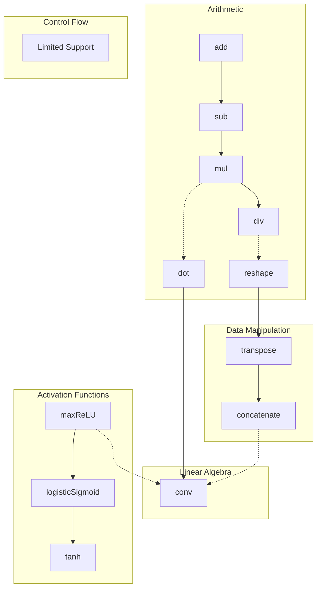
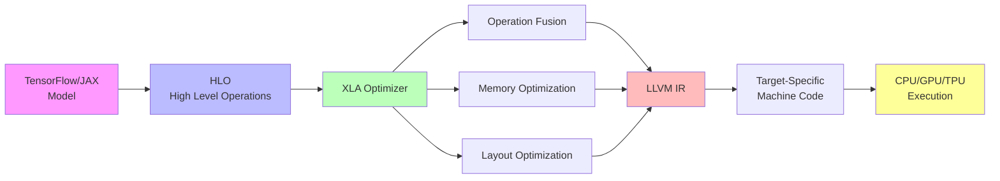

# XLA (Accelerated Linear Algebra) Operations

This document provides a visual overview of XLA operations and their relationships.

## What is XLA?

XLA (Accelerated Linear Algebra) is a domain-specific compiler for linear algebra that can accelerate TensorFlow models with potentially no source code changes. The XLA compiler takes models and compiles them into optimized machine code for various platforms including:

- **CPU**: x86 and ARM architectures
- **GPU**: NVIDIA and AMD GPUs
- **TPU**: Google's Tensor Processing Units
- **Custom accelerators**: Via LLVM backend

## XLA Operations Hierarchy

The following diagram shows the main categories of XLA operations and their relationships:



## Operation Categories

### Arithmetic Operations

Basic mathematical operations that form the foundation of neural network computations:

- **add**: Element-wise addition
- **sub**: Element-wise subtraction
- **mul**: Element-wise multiplication
- **div**: Element-wise division
- **neg**: Negation
- **abs**: Absolute value
- **exp**: Exponential
- **log**: Natural logarithm
- **pow**: Power operation

### Linear Algebra Operations

Matrix and tensor operations critical for deep learning:

- **dot**: Dot product / matrix multiplication
- **conv**: Convolution operations (1D, 2D, 3D)
- **batch_matmul**: Batched matrix multiplication
- **triangular_solve**: Solve triangular systems
- **cholesky**: Cholesky decomposition
- **qr**: QR decomposition

### Activation Functions

Non-linear transformations applied to neural network layers:

- **relu**: Rectified Linear Unit
- **maxReLU**: Max variant of ReLU
- **logisticSigmoid**: Sigmoid activation
- **tanh**: Hyperbolic tangent
- **elu**: Exponential Linear Unit
- **selu**: Scaled Exponential Linear Unit
- **softmax**: Softmax normalization
- **gelu**: Gaussian Error Linear Unit

### Data Manipulation

Operations for reshaping and rearranging tensors:

- **reshape**: Change tensor dimensions
- **transpose**: Swap axes
- **concatenate**: Join tensors along axis
- **slice**: Extract tensor subset
- **pad**: Add padding to tensors
- **gather**: Gather elements by indices
- **scatter**: Scatter elements by indices
- **broadcast**: Broadcast to larger shape

### Control Flow

**Note**: XLA has limited support for dynamic control flow. Most control flow should be expressed through:

- **select**: Conditional selection (ternary operator)
- **while**: While loops (limited support)
- **conditional**: If-then-else (limited support)

For better performance, prefer static shapes and vectorized operations over dynamic control flow.

## XLA Compilation Pipeline



## Key Benefits of XLA

1. **Performance**: Optimized machine code for target hardware
2. **Memory Efficiency**: Reduced memory footprint through fusion
3. **Portability**: Same code runs on different accelerators
4. **Automatic Optimization**: No manual tuning required
5. **Reduced Overhead**: Eliminates TensorFlow runtime overhead

## Usage Examples

### TensorFlow with XLA

```python
import tensorflow as tf

# Enable XLA for a single function
@tf.function(jit_compile=True)
def compute(x, y):
    return tf.matmul(x, y) + tf.reduce_sum(x)

# Enable XLA globally
tf.config.optimizer.set_jit(True)
```

### JAX (XLA by default)

```python
import jax
import jax.numpy as jnp

# JAX uses XLA automatically
@jax.jit
def compute(x, y):
    return jnp.dot(x, y) + jnp.sum(x)

# Compile for specific device
compute_gpu = jax.jit(compute, device=jax.devices('gpu')[0])
```

## Performance Considerations

- **Static Shapes**: XLA performs best with static tensor shapes
- **Operation Fusion**: Related operations are automatically fused
- **Avoid Python Control Flow**: Use TensorFlow/JAX ops instead
- **Batch Operations**: Process multiple examples simultaneously
- **Profile First**: Use XLA profiler to identify bottlenecks

## Resources

- [XLA Official Documentation](https://www.tensorflow.org/xla)
- [XLA Architecture Overview](https://www.tensorflow.org/xla/architecture)
- [JAX Documentation](https://jax.readthedocs.io/)
- [XLA Performance Guide](https://www.tensorflow.org/xla/performance)

---

*This documentation is part of the XLA_gpt project. For more information, see the main README.*
