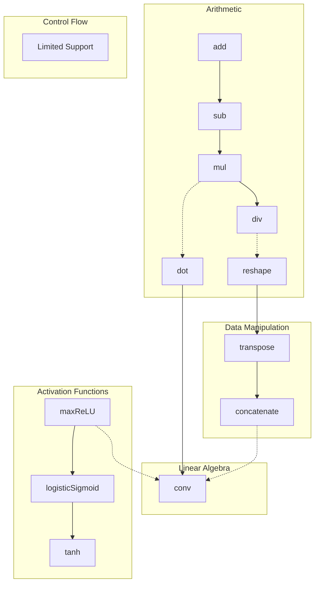

```mermaid
graph TD
    subgraph Arithmetic
        A1[add] --> A2[sub]
        A2 --> A3[mul]
        A3 --> A4[div]
        A3 -.-> B1[dot]  
        A4 -.-> D1[reshape] 
    end
    subgraph Linear Algebra
        B1[dot] --> B2[conv]
    end
    subgraph Activation Functions
        C1[maxReLU] --> C2[logisticSigmoid]
        C2 --> C3[tanh]
        C1 -.-> B2[conv] 
    end
    subgraph Data Manipulation
        D1[reshape] --> D2[transpose]
        D2 --> D3[concatenate]
        D3 -.-> B2[conv]
    end
    subgraph Control Flow
        E1[Limited Support]
    end
```
