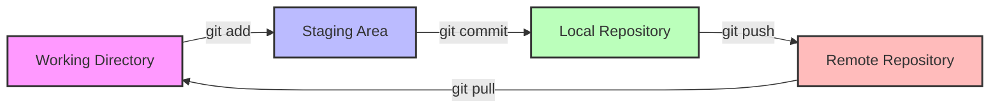
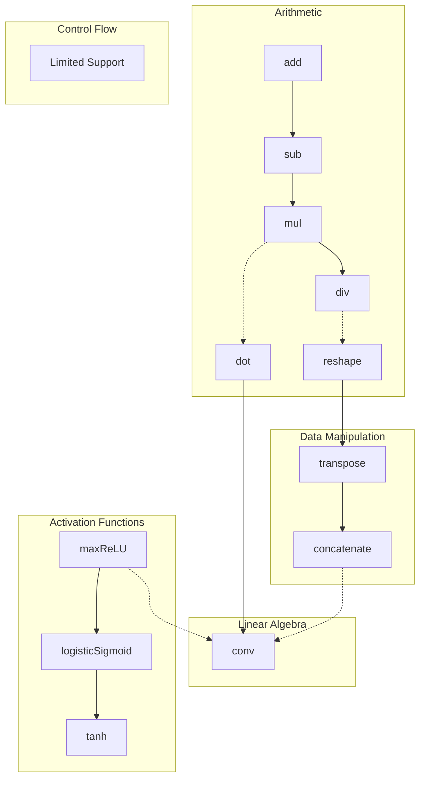

# XLA_gpt

A comprehensive resource for learning about **XLA (Accelerated Linear Algebra)** and **Git version control**, complete with visual Mermaid diagrams for enhanced understanding.

## 📚 Documentation

This repository contains detailed tutorials and references organized into focused topics:

### [Git Tutorial](docs/git-tutorial.md)
Comprehensive guide to Git version control with visual Mermaid diagrams covering:
- 🔄 Git workflow basics and file states
- 🌿 Branching strategies and best practices
- 🔀 Merging and rebasing workflows
- 🌐 Remote operations and collaboration
- ⏰ History navigation and time travel
- ⚔️ Conflict resolution strategies
- 📋 Quick reference cheat sheet

### [XLA Operations](docs/xla-operations.md)
Deep dive into XLA (Accelerated Linear Algebra) operations including:
- ➕ Arithmetic operations
- 🔢 Linear algebra primitives
- 📊 Activation functions
- 🔧 Data manipulation operations
- 🚀 Compilation pipeline overview
- 💡 Performance optimization tips
- 📖 Usage examples for TensorFlow and JAX

## 🎯 Quick Start

### For Git Learners

If you're here to learn Git, start with the [Git Tutorial](docs/git-tutorial.md). It includes:

```bash
# Clone this repository to get started
git clone <repository-url>
cd XLA_gpt

# Explore the Git tutorial
cat docs/git-tutorial.md
```

### For XLA Developers

If you're working with XLA and neural network accelerators:

```bash
# Read the XLA operations guide
cat docs/xla-operations.md

# Review the operation hierarchy diagram
# (Best viewed in a Mermaid-compatible viewer)
```

## 🎨 Visual Learning

This repository uses **Mermaid diagrams** extensively to visualize complex concepts. For the best experience:

- **GitHub/GitLab**: Diagrams render automatically
- **VS Code**: Install the "Markdown Preview Mermaid Support" extension
- **Command Line**: Use `mdcat`, `glow`, or similar Markdown renderers
- **Browser**: Use browser extensions like "Markdown Viewer" with Mermaid support

## 📊 Repository Structure

```
XLA_gpt/
├── README.md                  # This file - main entry point
├── LICENSE                    # License information
└── docs/
    ├── git-tutorial.md       # Comprehensive Git guide with diagrams
    └── xla-operations.md     # XLA operations reference
```

## 🤝 Contributing

Contributions are welcome! Whether you want to:

- Add more Git examples or scenarios
- Expand XLA operation coverage
- Improve existing diagrams
- Fix typos or clarify explanations
- Add new visual diagrams

Please feel free to:

1. Fork this repository
2. Create a feature branch (`git checkout -b feature/amazing-addition`)
3. Commit your changes (`git commit -m 'Add amazing feature'`)
4. Push to the branch (`git push origin feature/amazing-addition`)
5. Open a Pull Request

## 📖 Key Diagrams Preview

### Git Workflow Overview

The fundamental Git workflow showing how changes move through different stages:



### XLA Operations Hierarchy

Overview of XLA operation categories and their relationships:



## 🔗 Additional Resources

### Git Resources
- [Official Git Documentation](https://git-scm.com/doc)
- [Pro Git Book](https://git-scm.com/book/en/v2)
- [GitHub Git Guides](https://github.com/git-guides)

### XLA Resources
- [XLA Official Documentation](https://www.tensorflow.org/xla)
- [XLA Architecture Overview](https://www.tensorflow.org/xla/architecture)
- [JAX Documentation](https://jax.readthedocs.io/)

## 📝 License

This project is licensed under the terms specified in the [LICENSE](LICENSE) file.

## ✨ Acknowledgments

- **Mermaid.js** for enabling beautiful diagrams in Markdown
- **XLA Team** at Google for creating and maintaining XLA
- **Git Community** for the powerful version control system
- All contributors who help improve this resource

---

**Happy Learning!** Whether you're mastering Git or optimizing with XLA, we hope these visual guides make your journey clearer and more enjoyable. 🚀

For detailed information, explore the documentation in the [`docs/`](docs/) directory.
